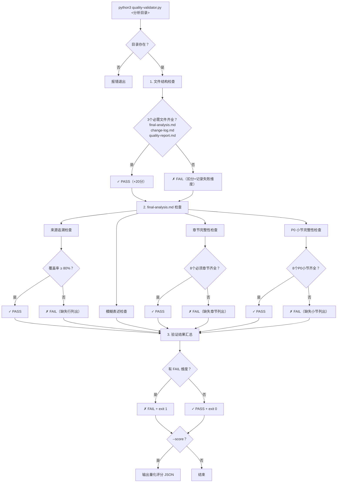
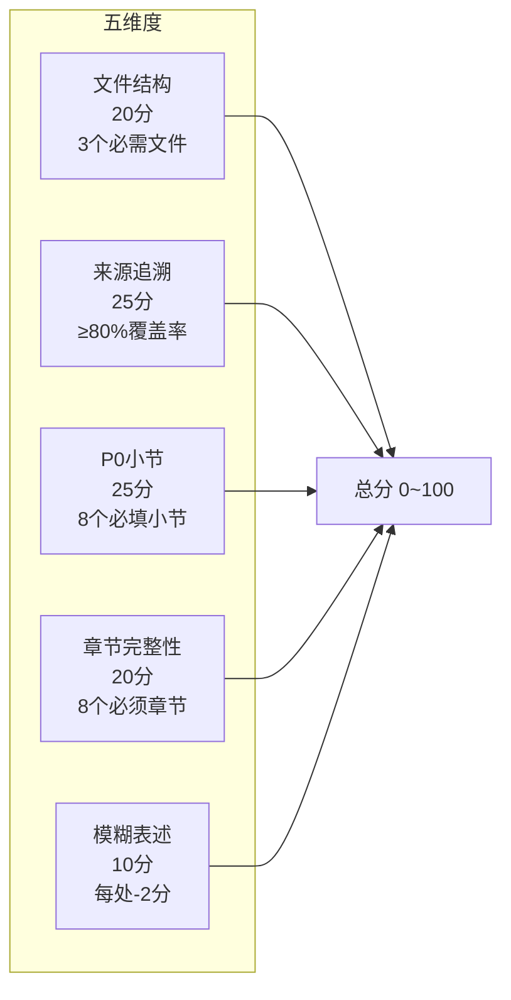

# Quality Validator 使用说明

**版本**: v0.4.0
**位置**: `scripts/quality-validator.py`
**运行环境**: Python 3.9+，无第三方依赖

---

## 用法

```bash
python3 quality-validator.py <分析目录> [--score]
```

- 不带 `--score`：输出诊断报告，exit code 0（PASS）或 1（FAIL）
- 带 `--score`：额外输出量化评分 JSON（满分 100）

---

## 执行流程



---

## 检查维度一览



### 维度详情

| 维度 | 满分 | 扣分规则 | FAIL 条件 |
|------|------|---------|-----------|
| 文件结构 | 20 | 每缺一个必需文件扣约 7 分 | 任何必需文件缺失 |
| 来源追溯 | 25 | 按 pass_rate 线性折算 | 覆盖率 < 80% |
| P0 小节完整性 | 25 | 每缺一个 P0 小节扣约 3 分 | 任何 P0 小节缺失 |
| 章节完整性 | 20 | 每缺一个必须章节扣 2.5 分 | 任何必须章节缺失 |
| 模糊表述 | 10 | 每处扣 2 分 | 不单独导致 FAIL |

---

## 文件检查规则

### 必需文件

| 文件 | 说明 |
|------|------|
| `final-analysis.md` | Full Mode 主输出（八章节+总结） |
| `change-log.md` | 协作变更记录 |
| `quality-report.md` | AI 自评质量报告 |

缺失任一 → FAIL + 扣分。

### 可选文件

| 文件 | 说明 |
|------|------|
| `quick-analysis.md` | Quick Mode 快速分析（Quick Mode 产物） |

缺失不扣分，存在时标注为可选通过。

---

## 章节完整性

### 必须章节（8个）

一、概述 → 二、用户 → 三、现状 → 四、业务目标 → 五、策略 → 六、方案与验证 → 七、风险与建议 → 总结

### 可选章节

八、各角色重点关注（P2 内容，缺失不导致 FAIL）

---

## P0 必填小节（8个）

对 `final-analysis.md` 用正则匹配 `小节号.*小节名` 检测是否存在：

| 小节 | 所属章节 | 正则模式 |
|------|---------|---------|
| 1.1 需求概述 | 一、概述 | `1\.1.*需求概述` |
| 1.2 需求来源 | 一、概述 | `1\.2.*需求来源` |
| 2.1 核心用户画像 | 二、用户 | `2\.1.*核心用户画像` |
| 2.3 场景与用户目标 | 二、用户 | `2\.3.*场景与用户目标` |
| 3.1 现状与根因拆解 | 三、现状 | `3\.1.*现状与根因拆解` |
| 4.1 业务北极星 | 四、业务目标 | `4\.1.*业务北极星` |
| 6.1 MVP | 六、方案与验证 | `6\.1.*MVP` |
| 6.3 需求全清单与优先级分级 | 六、方案与验证 | `6\.3.*需求全清单与优先级分级` |

---

## 来源追溯规则

### 检查范围

只检查 `final-analysis.md`，遍历所有表格数据行和列表项。

### 合法来源标注

| 模式 | 示例 |
|------|------|
| `[PRD第X节]` | [PRD第1节]、[PRD 需求清单] |
| `[截图 N]` | [截图 1]、[截图 2 局部] |
| `[PDF第N页]` | [PDF第3页表格] |
| `[Figma...]` | [Figma设计稿] |
| `[PM 确认]` | [PM 确认：交设计处理] |
| `[用户确认]` | [用户确认 19:16] |
| `[推断...]` | [推断：参考同类产品]、[分析推断] |
| `[缺失]` | [缺失] |
| `[CHG-N]` | [CHG-003] |

### 跳过的行

| 跳过类型 | 说明 |
|----------|------|
| 代码块内 | 代码块（```包围）中的行全部跳过 |
| 表头行 | 首列匹配"字段"、"内容"、"维度"、"功能点"等关键词 |
| 纯数字/百分比行 | 单元格全部为数字、%、括号 |
| 引用行 | 内容列以 `[见...`、`[缺失]`、`—` 开头 |
| 来源注脚行 | `来源：...` 格式的引用行 |
| 结构说明行 | `参考：...`、`说明：...` 等前缀行 |
| 下一行有来源 | `**场景**：...` 后紧跟 `- 来源：...` |

### 跳过的章节

| 章节 | 原因 |
|------|------|
| 总结 | 结论汇总，已在正文中追溯 |
| 待澄清项 | AI 生成的问题，无外部来源 |
| 八、各角色重点关注 | P2 可选内容 |

### 不追溯的文件

| 文件 | 原因 |
|------|------|
| `change-log.md` | 协作过程记录 |
| `quality-report.md` | AI 评估文档 |
| `quick-analysis.md` | Quick Mode 快速分析 |

### 通过阈值

`pass_rate = (已检查行 - 缺失来源行) / 已检查行`

≥ 80% → PASS，< 80% → FAIL。空文档（无检查行）视为 1.0（vacuously passes）。

---

## 模糊表述检测

`final-analysis.md` 中出现的以下词汇会被标记为 ⚠ WARN（不单独导致 FAIL）：

适当、合理、友好、简洁、清晰、尽量、尽可能、TBD、待定、暂定、后续确认、后续讨论

以下词汇因高误报率已移除：相关、一般、通常、正常情况下。

---

## --score 量化评分输出

```json
{
  "total": 85,
  "dimensions": {
    "file_structure": 20,
    "traceability": 22,
    "p0_sections": 22,
    "chapters": 16,
    "vague_terms": 6
  },
  "pass": false
}
```

- `total`: 0-100 总分
- `pass`: 取决于是否有任何 FAIL 维度
- 整体评价遵循"任一维度 FAIL → pass=false"