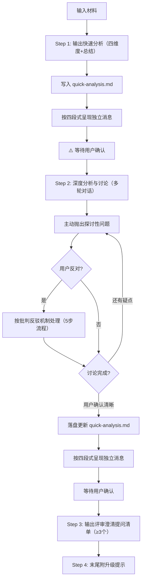

# Quick Mode 流程

## 流程图

## 四维度分析框架概要

每个维度的分析重点（详细模板见 `assets/analysis-template-quick.md`）：

**问题（Who & What Problem）**：要解决"谁的什么问题"
- 目标用户是谁？（角色、特征、量级）
- 他们遇到了什么具体问题？（用户视角的障碍）
- 问题发生在什么场景？（何时何地做什么时遇到）
- 场景特征与严重程度（频次、环境、影响范围）

> 🔧 **分析方法**：填充本维度时，参考 `references/analysis-methods.md`：
> - 需求描述了功能但没说为什么 → **X-Y Problem 识别**（方法二），追问真实问题
> - 需求看起来合理但担心脱离实际 → **场景还原法**（方法三），用时间×空间×心境还原

**目标（Goal）**：达成什么目标
- 业务目标是什么？（关联业务战略）
- 用户目标是什么？（与问题直接对应）
- 目标是否可量化？目标之间是否存在冲突？

**供给（Solution）**：提供什么解决方案
- 当前方案的核心供给是什么？（功能/内容/服务）
- 供给能否解决问题、达成目标？理由链条
- 批判性判断：更好策略？逻辑遗漏？替代方案优劣对比？

> 🔧 **分析方法**：填充本维度时，参考 `references/analysis-methods.md`：
> - 方案治标不治本 → **HMW 发散法**（方法四），帮助找到替代方向
> - MVP 边界模糊或过于膨胀 → **MVP 敏捷拆解法**（方法五），分层切割

**指标（Metrics）**：如何衡量需求达成
- 核心衡量指标有哪些？（定义 + 统计口径）
- 基准值 → 目标值（缺失标 ⚠️ 数据缺失）

## Step 1：快速分析（四维度 + 总结）

读取 `assets/analysis-template-quick.md`，填充四维度分析表格 + 总结。**澄清提问清单不在 Step 1 输出，仅在 Step 3 作为结束动作输出。**

> 🚨 **强制约束（防退化机制）**：
> 1. **必须 100% 复制**模板中的 Markdown 表格结构（表头和左侧维度列），**绝对禁止**自行发明列表、编号或更改表格结构！
> 2. **禁止纯摘要**：必须包含你的专业判断。特别是"供给"维度的"批判性判断"，必须指出逻辑漏洞或更优解。
> 3. **🛑 零编造原则**：遇到 PRD 未提及的信息或数据，❌ 绝对禁止自行估算、脑补或标注 `[AI推断]`。必须直接标注 `⚠️ 数据缺失` 或 `⚠️ 逻辑未明确`。
> 4. **缺失必追问**：所有标注 `⚠️` 的缺口，必须在 Step 3 提问清单中转化为向 PM 的澄清提问，形成暴露→追问闭环。
> 5. **输出完 Step 1 的四维度表格和总结后，必须立即停止输出！** 抛出 2-4 个探讨性问题并等待用户回复，**绝对禁止**在第一轮对话就直接输出"提问清单（Step 3）"。
> 6. **📝 Step 1 完成后必须立即写入文件**：将四维度分析表格 + 总结写入 `quick-analysis.md`（使用 `assets/analysis-template-quick.md` 模板结构），不允许只在对话中输出而不落盘。

Step 1 写入文件后，按 `references/collaboration-protocol.md` §四段式独立消息通用结构的 **Quick Mode Step 1** 定义输出独立消息：呈现四维度表格 + 总结全文、⚠️ 标注项、确认提示语，等待用户确认后再进入 Step 2。

## Step 2：深度分析与讨论（UX 视角聚焦）

本阶段核心定位：**以用户体验与需求本质为锚点，进行多轮辩证探讨**。所有讨论必须回归"对用户意味着什么"，禁止陷入纯技术实现或纯业务 KPI 争论。

### 🔹 讨论视角约束（强制）
每轮探讨必须至少覆盖以下 2 个 UX/需求视角，提问与判断需严格遵循：
1. **用户旅程与场景还原**：不聊抽象功能，必须代入具体场景（如"用户在弱网/单手/排队焦虑时，这个弹窗会打断什么？"）
2. **认知与操作成本**：评估方案是否增加记忆负担、操作步骤、决策犹豫（如"9种码合并为1个，用户是否需要重新学习核销规则？迁移成本是否被低估？"）
3. **体验一致性与边界场景**：主流程之外的异常流、边缘用户、降级体验是否被忽略（如"扫码失败/权限过期/网络超时，用户看到什么？能否自救？"）
4. **需求真实性 vs PM 假设**：区分"用户真痛点"与"业务伪需求"（如"导购记不住入口是培训问题还是产品架构问题？一码通是否过度设计？"）

### 🔹 提问句式规范（UX 导向）
抛出问题时，必须采用 `场景/用户视角 + 体验影响 + 探讨选项` 结构，示例：
- ✅ "在收银台排队场景下，用户打开会员码需等待加载，这会加剧焦虑。是否考虑预加载或离线码降级？你觉得优先保速度还是保数据实时性？"
- ✅ "当前方案将多套核销逻辑折叠进 1 个入口，用户是否需要重新建立心智？我们是否高估了用户的迁移意愿？"
- ❌ 禁止："这个接口怎么对接？""业务方要求 Q3 上线，能赶上吗？""技术上用方案 A 还是 B？"（除非明确说明该技术决策对 UX 的直接影响）

### 🔹 多轮迭代机制
- **每轮抛出 2～3 个聚焦问题**，等待用户回复后再推进，禁止一次性倾倒所有疑问。
- **用户确认/补充后**：必须显式记录达成的结论（标注 `[经讨论确认]`），用于最终更新 `quick-analysis.md`，保持文档与分析同步。
- **若用户反对或坚持原方案**：立即触发 `references/collaboration-protocol.md` 的批判反驳 5 步流程，但**反驳论据必须基于用户体验/需求逻辑**（如迁移成本、认知负荷、场景覆盖率、体验断裂风险），而非开发成本或排期。
- **收敛条件**：当核心用户场景的体验路径已清晰、关键矛盾已对齐、无重大 UX 盲区时，主动提示：*"当前用户视角的核心逻辑已对齐，是否进入 Step 3 输出评审提问清单？"*

### 🔹 讨论结束落盘（进入 Step 3 前）
当用户确认"可以了/没问题了"时，**必须先完成以下动作再进入 Step 3**：
1. 将 Step 2 讨论中所有 `[经讨论确认]` 的结论更新到 `quick-analysis.md`
2. 将修正后的完整四维度表格 + 总结重新写入文件（不是追加，是覆盖更新）

落盘完成后，按 `references/collaboration-protocol.md` §四段式独立消息通用结构的 **Quick Mode Step 2→3** 定义输出独立消息：呈现修正后的四维度表格 + 总结 + [经讨论确认] 标注要点全文、剩余待确认项、确认提示语，等待用户确认后再进入 Step 3。

### 🔹 分析方法按需调用

在讨论中遇到以下情况时，主动读取 `references/analysis-methods.md` 使用对应方法：

| 触发信号 | 方法 | 引用 |
|---------|------|------|
| 想挖需求根因为什么 | 五问法（5 Whys） | `references/analysis-methods.md` §方法一 |
| 需求直接描述了方案(Y)，需追真实问题(X) | X-Y Problem 识别 | `references/analysis-methods.md` §方法二 |
| 需代入用户真实使用环境评估方案 | 场景还原法（时间×空间×心境） | `references/analysis-methods.md` §方法三 |
| 方案存在高迁移成本或逻辑错位，需发散替代 | HMW 发散法 | `references/analysis-methods.md` §方法四 |
| 需求范围过大或 MVP 边界模糊 | MVP 敏捷拆解法 | `references/analysis-methods.md` §方法五 |

使用时原文读取方法详情，按步骤执行，将结果融入讨论和分析输出。

### 🔹 防漂移负向约束
- ❌ 禁止脱离具体用户场景讨论"架构优劣"或"业务战略"
- ❌ 禁止用"提升体验""优化流程"等模糊表述，必须落地到可感知的交互细节或用户行为
- ❌ 禁止在用户未确认前自行脑补结论或提前输出 Step 3 清单
- ❌ 禁止将"业务目标未达成"直接等同于"体验问题"，必须拆解到用户行为链路上的具体断点

## Step 3：评审澄清提问清单

用户明确表示"没有问题了/可以了/出提问清单吧"后 → 严格按照模板表格输出评审澄清提问清单（≥3 个犀利提问）。

协作讨论规范见 `references/collaboration-protocol.md` §通用协作讨论环节流程

## Step 4：升级提示

末尾附升级提示：*"已为您快速提取核心漏洞。若需基于此需求输出完整的 Full Mode 分析说明书，请回复「执行 Full Mode」。"*

## 输出文件

- `quick-analysis.md` — Quick Mode 快速分析（使用 `assets/analysis-template-quick.md`）
- `change-log.md` — 协作记录（仅在 Step 2 产生分歧时创建）

## 输出结构概要

最终 `quick-analysis.md` 包含：

1. **四维度分析表格 + 总结**（问题 → 目标 → 供给 → 指标，每个维度一张 Markdown 表格 + 总结判定）
2. **澄清提问清单**（≥3 个犀利提问，每个含：提问内容 + 追问理由 + 关联维度 & 缺口）
3. **升级提示**（末尾附："已为您快速提取核心漏洞。若需基于此需求输出完整的 Full Mode 分析说明书，请回复「执行 Full Mode」。"）

## 特殊情况处理

### 信息严重不足

当用户输入过于简略（如只说"帮我看一下这个需求"且无实质性内容）：

1. **不强行分析** — 不要基于大量假设填充分析表格，避免误导
2. **输出结构化问题清单** — 列出必要信息 + 补充信息，引导用户补充
3. **问题清单格式**：
    为了进行准确的需求分析，我需要了解以下信息：
    
    必要信息（缺失则无法分析）：
    1. [信息项] — [为什么需要]
    2. ...
    
    补充信息（帮助更深入分析）：
    1. [信息项]
    2. ...
4. 补充后重新从 Step 1 开始

### 需求明显不合理

当分析发现需求存在严重逻辑问题（如供给与目标方向相反、MVP 远超核心场景）：

1. **不直接否定** — 保持建设性，明确说"基于分析，我发现当前方案可能存在以下风险"
2. **指出具体问题 + 提供替代方向** — 每个问题附分析依据，至少提供 2 个替代思路
3. **邀请讨论** — "你倾向于哪个方向？或者有其他想法？让我们深入讨论一下。"
4. 按批判反驳机制处理（见 `references/collaboration-protocol.md`）

### 超出交互设计专业范围

当需求涉及技术架构可行性、商业模式、营销策略等非交互设计核心领域：

1. **明确声明边界** — "关于XXX的评估超出了交互设计的专业范围，建议咨询XXX团队"
2. **聚焦可分析的部分** — 从交互设计角度分析：用户体验影响、交互流程合理性、信息架构设计
3. **专业范围内给出判断** — 不因整体无法评估就放弃局部分析

## 注意事项

- Quick Mode 不适用 Full Mode 的 P0 缺口门禁规则（无分阶段输出），但消息块 3 中需列出 ⚠️ 标注项（数据缺失 / 逻辑未明确），转化为待确认项
- Quick Mode 不执行 quality-validator 质量验证