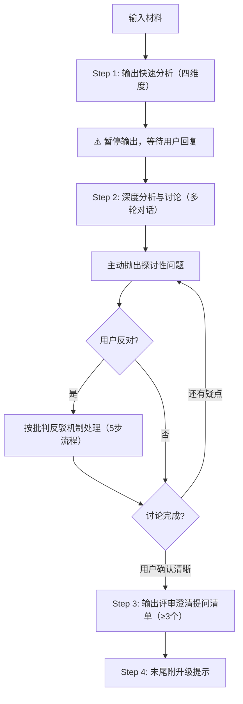

# Quick Mode 流程

## 流程图

## Step 1：快速分析（四维度）

读取 `assets/analysis-template-quick.md`，填充四维度快速分析。

> 🚨 **强制约束（防退化机制）**：
> 1. **必须 100% 复制**模板中的 Markdown 表格结构（表头和左侧维度列），**绝对禁止**自行发明列表、编号或更改表格结构！
> 2. **禁止纯摘要**：必须包含你的专业判断。特别是"供给"维度的"批判性判断"，必须指出逻辑漏洞或更优解。
> 3. **必须执行推断**：遇到 PRD 未提及的信息，绝不允许留空或只写"未提及"，必须使用 `[AI推断]` 给出合理估算。
> 4. **输出完 Step 1 的四个表格后，必须立即停止输出！** 抛出 1-2 个探讨性问题并等待用户回复，**绝对禁止**在第一轮对话就直接输出"提问清单（Step 3）"。

## Step 2：深度分析与讨论

基于快速分析发起深度分析与讨论（多轮对话）：
- 主动抛出探讨性问题：
  - "我注意到这个供给可能存在XXX问题，你觉得呢？"
  - "有没有考虑过XXX场景下可能出现的情况？"
  - "这个指标是否真的能反映目标的达成？我们是否需要补充XXX指标？"
  - "业务目标和用户目标之间是否存在冲突？如果有，我们如何平衡？"
- 若用户反对 → 按批判反驳机制处理（见 `references/collaboration-protocol.md`）
- 不断迭代分析结果，直到用户确认逻辑清晰。

## Step 3：评审澄清提问清单

用户明确表示"没有问题了/可以了/出提问清单吧"后 → 严格按照模板表格输出评审澄清提问清单（≥3 个犀利提问）。

协作讨论规范见 `references/collaboration-protocol.md` §通用协作讨论环节流程

## Step 4：升级提示

末尾附升级提示：*"已为您快速提取核心漏洞。若需基于此需求输出完整的 Full Mode 分析说明书，请回复「执行 Full Mode」。"*

## 输出文件

- `quick-analysis.md` — Quick Mode 快速分析（使用 `assets/analysis-template-quick.md`）
- `change-log.md` — 协作记录（仅在 Step 2 产生分歧时创建）

## 注意事项

- Quick Mode 不适用 P0 缺口规则（无分阶段输出）
- Quick Mode 不执行 quality-validator 质量验证