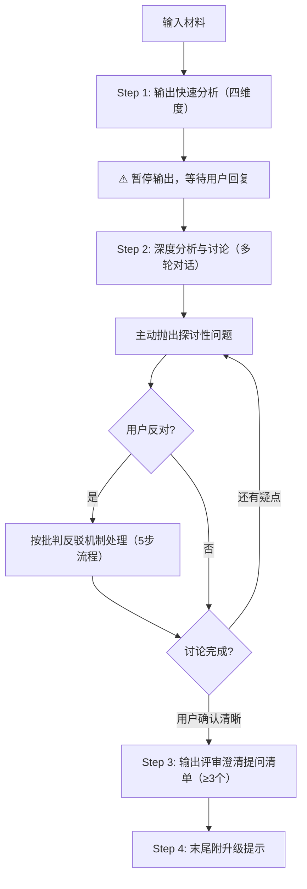

# Quick Mode 流程

## 流程图



## 四维度分析框架概要

每个维度的分析重点（详细模板见 `assets/analysis-template-quick.md`）：

**问题（Who & What Problem）**：要解决"谁的什么问题"
- 目标用户是谁？（角色、特征、量级）
- 他们遇到了什么具体问题？（用户视角的障碍）
- 问题发生在什么场景？（何时何地做什么时遇到）
- 场景特征与严重程度（频次、环境、影响范围）

**目标（Goal）**：达成什么目标
- 业务目标是什么？（关联业务战略）
- 用户目标是什么？（与问题直接对应）
- 目标是否可量化？目标之间是否存在冲突？

**供给（Solution）**：提供什么解决方案
- 当前方案的核心供给是什么？（功能/内容/服务）
- 供给能否解决问题、达成目标？理由链条
- 批判性判断：更好策略？逻辑遗漏？替代方案优劣对比？

**指标（Metrics）**：如何衡量需求达成
- 核心衡量指标有哪些？（定义 + 统计口径）
- 基准值 → 目标值（缺失标 ⚠️ 数据缺失）

## Step 1：快速分析（四维度）

读取 `assets/analysis-template-quick.md`，填充四维度快速分析。

> 🚨 **强制约束（防退化机制）**：
> 1. **必须 100% 复制**模板中的 Markdown 表格结构（表头和左侧维度列），**绝对禁止**自行发明列表、编号或更改表格结构！
> 2. **禁止纯摘要**：必须包含你的专业判断。特别是"供给"维度的"批判性判断"，必须指出逻辑漏洞或更优解。
> 3. **必须执行推断**：遇到 PRD 未提及的信息，绝不允许留空或只写"未提及"，必须使用 `[AI推断]` 给出合理估算。
> 4. **数据缺失必须暴露**：无基线数据 → 标 `⚠️ 数据缺失`，绝不编造数据。
> 5. **输出完 Step 1 的四个表格后，必须立即停止输出！** 抛出 1-2 个探讨性问题并等待用户回复，**绝对禁止**在第一轮对话就直接输出"提问清单（Step 3）"。

## Step 2：深度分析与讨论

基于快速分析发起深度分析与讨论（多轮对话）：
- 主动抛出探讨性问题：
  - "我注意到这个供给可能存在XXX问题，你觉得呢？"
  - "有没有考虑过XXX场景下可能出现的情况？"
  - "这个指标是否真的能反映目标的达成？我们是否需要补充XXX指标？"
  - "业务目标和用户目标之间是否存在冲突？如果有，我们如何平衡？"
- 若用户反对 → 按批判反驳机制处理（见 `references/collaboration-protocol.md`）
- 不断迭代分析结果，直到用户确认逻辑清晰。

## Step 3：评审澄清提问清单

用户明确表示"没有问题了/可以了/出提问清单吧"后 → 严格按照模板表格输出评审澄清提问清单（≥3 个犀利提问）。

协作讨论规范见 `references/collaboration-protocol.md` §通用协作讨论环节流程

## Step 4：升级提示

末尾附升级提示：*"已为您快速提取核心漏洞。若需基于此需求输出完整的 Full Mode 分析说明书，请回复「执行 Full Mode」。"*

## 输出文件

- `quick-analysis.md` — Quick Mode 快速分析（使用 `assets/analysis-template-quick.md`）
- `change-log.md` — 协作记录（仅在 Step 2 产生分歧时创建）

## 输出结构概要

最终 `quick-analysis.md` 包含：

1. **四维度分析表格**（问题 → 目标 → 供给 → 指标，每个维度一张 Markdown 表格）
2. **澄清提问清单**（≥3 个犀利提问，每个含：提问内容 + 追问理由 + 关联维度 & 缺口）
3. **升级提示**（末尾附："已为您快速提取核心漏洞。若需基于此需求输出完整的 Full Mode 分析说明书，请回复「执行 Full Mode」。"）

## 特殊情况处理

### 信息严重不足

当用户输入过于简略（如只说"帮我看一下这个需求"且无实质性内容）：

1. **不强行分析** — 不要基于大量假设填充分析表格，避免误导
2. **输出结构化问题清单** — 列出必要信息 + 补充信息，引导用户补充
3. **问题清单格式**：
   ```
   为了进行准确的需求分析，我需要了解以下信息：

   必要信息（缺失则无法分析）：
   1. [信息项] — [为什么需要]
   2. ...

   补充信息（帮助更深入分析）：
   1. [信息项]
   2. ...
   ```
4. 补充后重新从 Step 1 开始

### 需求明显不合理

当分析发现需求存在严重逻辑问题（如供给与目标方向相反、MVP 远超核心场景）：

1. **不直接否定** — 保持建设性，明确说"基于分析，我发现当前方案可能存在以下风险"
2. **指出具体问题 + 提供替代方向** — 每个问题附分析依据，至少提供 2 个替代思路
3. **邀请讨论** — "你倾向于哪个方向？或者有其他想法？让我们深入讨论一下。"
4. 按批判反驳机制处理（见 `references/collaboration-protocol.md`）

### 超出交互设计专业范围

当需求涉及技术架构可行性、商业模式、营销策略等非交互设计核心领域：

1. **明确声明边界** — "关于XXX的评估超出了交互设计的专业范围，建议咨询XXX团队"
2. **聚焦可分析的部分** — 从交互设计角度分析：用户体验影响、交互流程合理性、信息架构设计
3. **专业范围内给出判断** — 不因整体无法评估就放弃局部分析

## 注意事项

- Quick Mode 不适用 P0 缺口规则（无分阶段输出）
- Quick Mode 不执行 quality-validator 质量验证