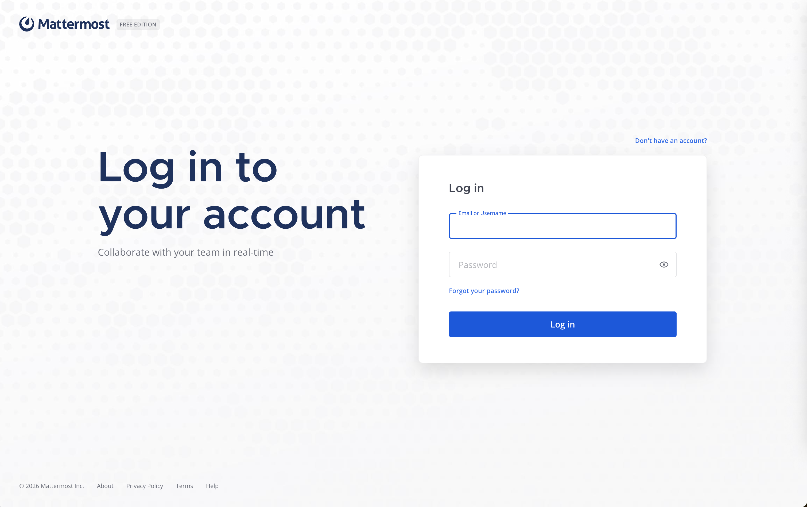
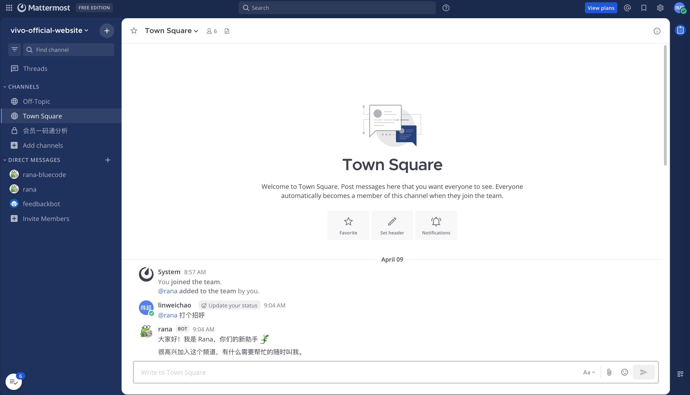
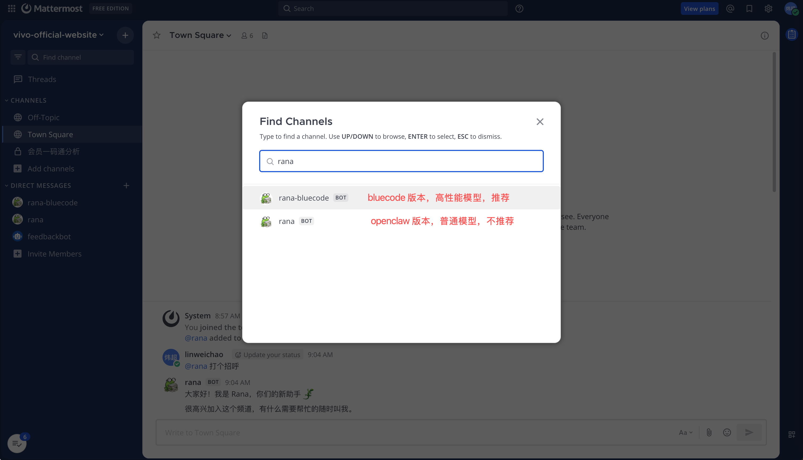
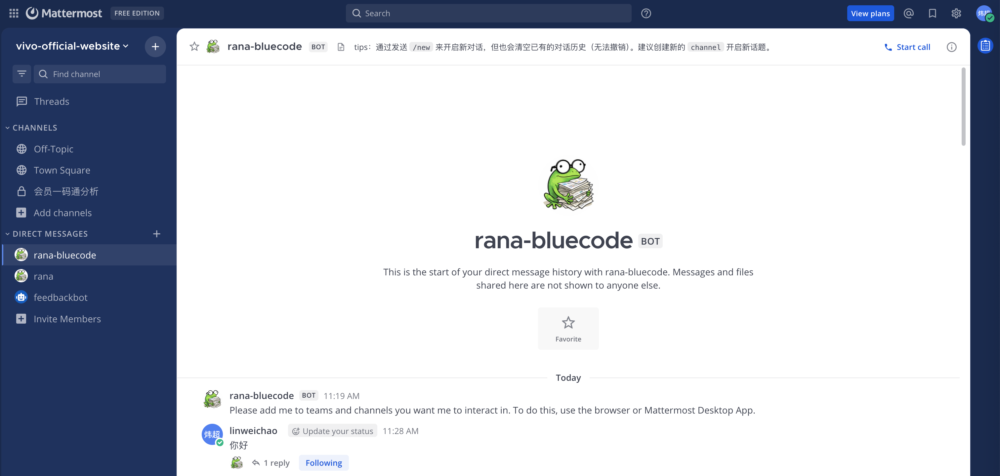
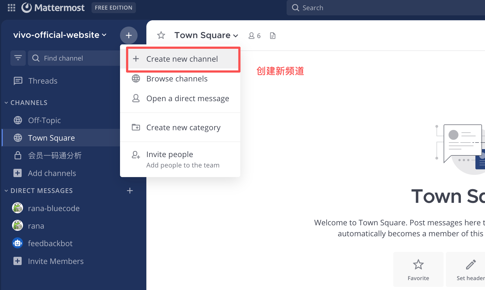
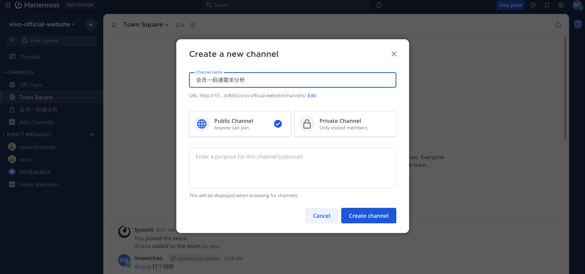
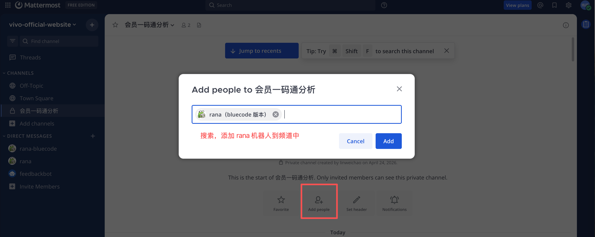

# 如何使用 rana 需求分析机器人

本指南帮助你通过 Mattermost 与 rana 机器人对话，完成 PRD 需求分析。

---

## 前置准备：加入 Mattermost 组织

rana 部署在公司自托管的 Mattermost 平台上。出于信息安全考虑，我们采用自托管方案，所有对话数据不离开内网。

**操作步骤：**

1. 点击[加入官网团队](http://10.109.65.184:8065/signup_user_complete/?id=qkg155ogf7du78faaq73obxboc)链接加入组织
2. 使用个人邮箱注册账号，设置密码（无需企业邮箱或企业账号，个人邮箱即可）

 注册账号并登录

3. 登录成功后进入**广场频道（Town Square）**

 广场频道首页

---

## 与 rana 建立对话

### 方式一：私聊（简单场景）

适用于临时、单一的需求快速分析。

1. 在左侧频道列表顶部搜索 **rana**

 搜索 rana

2. 点击 rana 的头像，发起**直接消息（Direct Message）**

 与 rana 的直接消息对话界面

### 方式二：独立频道（推荐）

适用于需要多轮讨论、需要保留完整上下文的正式需求分析。

1. 在左侧面板点击 **+** 创建新频道

 点击 + 号创建新频道

2. 设置频道名称（如 `需求分析-服务首页优化`），选择公开或私有

 设置频道名称与类型

3. 创建后点击频道成员管理，**Add Member** 加入 **rana**

 在成员列表中添加 rana

4. 在频道中直接 @rana 或直接发送消息即可

> 频道的优势：对话记录按需求隔离、可邀请团队成员旁听、不会与其他会话混淆。

---

## 注意事项

- `/clear` 会清除当前会话的所有上下文，rana 将忘记之前的讨论内容
- 每个频道/私聊的对话是独立的，切换频道不会影响其他会话
- 支持输入：纯文本 PRD、PDF 文件、截图